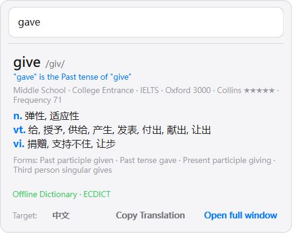
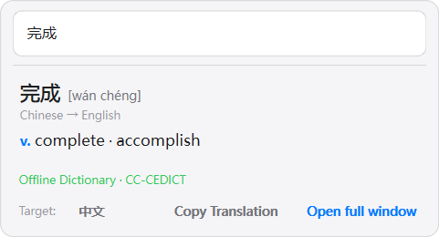
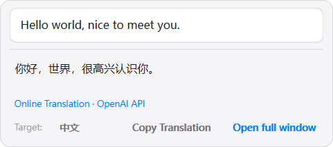
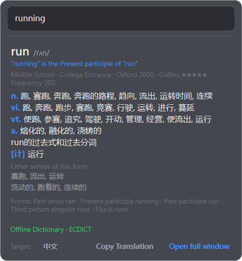
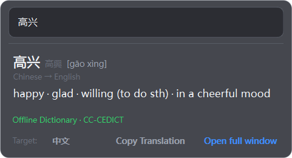

# 截图 & 剪切板管理软件 — 截图吧


## 项目简介

基于 PySide6和Rust 的截图软件和剪切板管理的windows平台软件。

支持区域截图、窗口智能识别、GIF录制、长截图拼接、OCR文字识别、图像钉图、翻译等功能，并内置了完整的剪切板历史管理系统，不限图片来源可以联动截图模块生成钉图或者提取文字。

内置**中英双向离线词典**：划词取到单个词时本地秒出结果——英文词给出音标、释义、考纲标签、柯林斯星级、词频与词形变化；中文词给出英文对应词（按词性归组）。无需联网、不消耗 API；结果下方会标明这次是「离线词典」还是「联网翻译」。

编译后单文件大小大约57MB（含 16MB 内置离线词典）.占用内存很低，低配电脑也可以流畅

---

## 安装前置依赖

本项目依赖4个自制 Rust 库，**必须先安装这些包才能运行程序**。

### 1. 创建并激活 Python 3.11 虚拟环境

```bash
python -m venv venv311
# Windows:
venv311\Scripts\activate
```

### 2. 安装 Python 依赖

```bash
python -m pip install --upgrade pip
python -m pip install -r requirements.txt
```

### 3. 安装自制 Rust 包（必须）

请在项目根目录执行：

```bash
python -m pip install gifrecorder-0.2.1-cp311-cp311-win_amd64.whl longstitch-0.3.11-cp311-cp311-win_amd64.whl pyclipboard-0.3.14-cp311-cp311-win_amd64.whl ppocr_rust-0.1.1-cp311-cp311-win_amd64.whl windows_media_ocr-0.4.0-cp311-cp311-win_amd64.whl
```

| 包名 | 版本 | 功能 |
|------|------|------|
| `gifrecorder` | 0.2.1 | GIF/视频合成编码器 |
| `longstitch` | 0.3.11 | 长截图拼接算法 |
| `pyclipboard` | 0.3.14 | 剪切板底层操作 |
| `ppocr_rust` | 0.1.1 | PP-OCR (PaddleOCR) ONNX 文字识别引擎（纯 Rust + ONNX Runtime，需 det/rec 模型） |
| `windows_media_ocr` | 0.4.0 | oneocr + windows media ocr Windows 自带 OCR 引擎（速度快，默认推荐） |

> **注意：** 这些 `.whl` 文件仅适用于 Windows x86_64 + Python 3.11 环境。请勿安装到全局 Python 中。

> **OCR 模型：** `ppocr_rust` 需要 `models/` 目录下的 PP-OCR ONNX 模型（`PP-OCRv6_det_small.onnx` + `PP-OCRv6_rec_small.onnx`），仓库已内置。打包发布后请将 `models/` 放在 exe 同级目录。

**开发/构建依赖（可选）：**

```bash
python -m pip install -r requirements-dev.txt
```

### 4. 运行程序

```bash
cd main
python main_app.py
```

---

## 目录结构总览

```
# 项目根目录
├── README.md / README_EN.md             # 中文、英文说明文档
├── pyproject.toml                                      # Python 项目元数据与依赖声明
├── requirements.txt                                   # 运行依赖
├── requirements-dev.txt                               # 测试与构建依赖
├── build_with_ocr_onefile.py                           # PyInstaller 单文件构建脚本
├── build_ecdict.py                                      # 英→中词典生成脚本（ecdict.csv → *.db）
├── build_cedict_zh_en.py                                # 中→英词典生成脚本（CC-CEDICT → *.db）
├── gifrecorder-0.2.1-cp311-cp311-win_amd64.whl       # GIF录制 Rust 预编译包
├── longstitch-0.3.11-cp311-cp311-win_amd64.whl        # 长截图拼接 Rust 预编译包
├── pyclipboard-0.3.14-cp311-cp311-win_amd64.whl      # 剪切板 Rust 预编译包
├── ppocr_rust-0.1.1-cp311-cp311-win_amd64.whl        # OCR Rust 预编译包
│
├── main/                    # Python 主程序
│   ├── main_app.py          # 应用入口，系统托盘、全局快捷键、生命周期管理
│   ├── compile_translations.py  # 翻译文件编译工具（.xml → .qm）
│   │
│   ├── canvas/              # 画布模块 — 图形编辑核心
│   ├── capture/             # 截图捕获模块 — 屏幕截图与窗口识别
│   ├── clipboard/           # 剪切板管理模块 — 历史记录、分组/快速启动、导入导出、搜索
│   ├── core/                # 核心基础模块 — 启动引导、日志、资源、主题、国际化、快捷键
│   ├── dictionary/          # 离线词典模块 — 中英双向（英→中 ECDICT / 中→英 CC-CEDICT）
│   ├── gif/                 # GIF录制模块 — 屏幕录制、编辑、回放、导出
│   ├── ocr/                 # OCR模块 — PP-OCR 文字识别
│   ├── pin/                 # 钉图模块 — 截图置顶、编辑、OCR、翻译
│   ├── settings/            # 设置模块 — 统一配置管理
│   ├── stitch/              # 长截图拼接模块 — 滚动截图、自动拼接
│   ├── tools/               # 绘图工具模块 — 笔、矩形、箭头、文字等
│   ├── translation/         # 翻译模块 — 多引擎翻译（OpenAI 兼容 API 等）
│   ├── translations/        # 语言资源 — 中文/英文/韩文
│   ├── ui/                  # 用户界面模块 — 通用UI组件库
│   └── tests/               # 测试模块 — 单元测试与集成测试
│
├── rust_libs/               # Rust 库源码（可自行编译）
│   ├── gifrecorder/         # GIF/视频合成编码器源码
│   ├── longstitch/          # 长截图拼接算法源码
│   ├── pyclipboard/         # 剪切板底层操作源码
│   └── ppocr_rust/          # PP-OCR (PaddleOCR) ONNX 识别引擎源码
│
├── models/                  # PP-OCR ONNX 模型文件（OCR 必需）
│   ├── PP-OCRv6_det_small.onnx   # 文本检测模型 (DBNet)
│   └── PP-OCRv6_rec_small.onnx   # 文本识别模型 (CRNN/CTC)
│
└── svg/                     # SVG 图标资源
```


## 模块详细说明

### canvas/ — 画布模块

图形编辑画布系统，提供场景管理、视图渲染、图形项选择和撤销/重做功能。

```
canvas/
├── __init__.py
├── scene.py                 # CanvasScene — 画布场景，继承 QGraphicsScene
├── view.py                  # CanvasView — 画布视图，继承 QGraphicsView，负责渲染和交互
├── selection_model.py       # SelectionModel — 管理被选中的图形项，支持多选
├── undo.py                  # CommandUndoStack — 撤销/重做栈，支持添加、删除、批量删除、编辑命令
├── smart_edit_controller.py # SmartEditController — 智能编辑控制器，处理选择与编辑模式切换
├── handle_editor.py         # LayerEditor / EditHandle — 图层编辑器，提供控制点拖拽编辑
└── items/                   # 绘制图形项
    ├── __init__.py
    ├── drawing_items.py     # StrokeItem / RectItem / EllipseItem / ArrowItem / TextItem / NumberItem — 所有绘制项目
    ├── background_item.py   # BackgroundItem — 选区背景底图
    └── selection_item.py    # SelectionItem — 选中项的边界显示框
```


**核心功能：**
- 基于 Qt Graphics View Framework 的画布系统
- 支持自由绘制、矩形、椭圆、箭头、文字、编号等图形项
- 完整的撤销/重做机制（基于 QUndoStack）
- 智能编辑控制器实现选择与绘制模式无缝切换
- 控制点编辑器支持图形变换

---

### capture/ — 截图捕获模块

屏幕截图和窗口智能识别的核心服务。

```
capture/
├── __init__.py
├── capture_service.py       # CaptureService — 截图服务，屏幕截图核心逻辑
└── window_finder.py         # WindowFinder — 窗口查找器，智能选择窗口，识别光标下的窗口
```

**核心功能：**
- 全屏截图和区域截图
- 智能窗口识别与选择（自动排除窗口阴影）
- 光标位置窗口检测

---

### clipboard/ — 剪切板管理模块

类似 Ditto 的剪切板历史管理系统，现已拆分为 controllers、core、services、ui 四层结构，支持文本、图片、HTML、文件等类型。
不仅能保存截图历史，还提供独立的三栏管理窗口用于维护分组与内容，并可从历史记录生成钉图。


```
clipboard/
├── __init__.py
├── controllers/             # 控制层 — 历史加载、粘贴流程、右键菜单、选择状态
│   ├── clipboard_controller.py   # ClipboardController — 历史加载、粘贴和菜单逻辑
│   ├── selection_manager.py      # SelectionManager — 列表选择状态管理
│   └── __init__.py
├── core/                    # 数据层 — pyclipboard 封装、数据模型、分组类型
│   ├── manager.py           # ClipboardManager — 数据存储、监听、粘贴 API
│   ├── models.py            # ClipboardItem / Group — 剪切板数据模型
│   ├── enums.py             # GroupType — 分组类型定义
│   └── __init__.py
├── services/                # 服务层 — 文件 payload、分组规则、导入导出、保存逻辑
│   ├── file_payload_service.py   # file 类型 JSON payload 与旧格式兼容
│   ├── group_service.py          # 分组图标、命名与删除确认辅助
│   ├── import_export_service.py  # 文本条目 CSV 导入/导出
│   └── manage_dialog_service.py  # 管理窗口保存逻辑
├── ui/
│   ├── dialogs/
│   │   └── manage_dialog.py      # 三栏管理窗口：分组、内容、导入导出
│   ├── forms/
│   │   ├── group_form.py
│   │   ├── text_content_form.py
│   │   ├── file_content_form.py
│   │   ├── import_export_form.py
│   │   └── group_icon_picker.py
│   ├── mixins/
│   │   └── frameless_mixin.py
│   ├── panels/
│   │   └── setting_panel.py
│   ├── resources/
│   │   └── emoji_data.py
│   ├── theme/
│   │   ├── themes.py
│   │   └── theme_styles.py
│   ├── widgets/
│   │   ├── draggable_list_widget.py
│   │   ├── group_bar.py
│   │   ├── item_delegate.py
│   │   ├── item_widget.py
│   │   └── preview_popup.py
│   └── windows/
│       ├── clipboard_window.py   # 历史窗口、搜索、预览与快捷粘贴
│       └── pin_window.py         # 从历史条目创建钉图
```

**核心功能：**
- 监听系统剪切板变化，自动保存历史记录
- 支持文本、图片、HTML、文件等多种格式
- 支持通用分组、快速启动分组、收藏与搜索
- 独立三栏管理窗口，可编辑分组、文本内容和文件内容
- 文本条目支持 CSV 导入/导出
- 多主题 UI（亮色/暗色等）
- 快捷键快速粘贴历史内容
- 预览弹窗支持大图/长文查看

---

### core/ — 核心基础模块

提供日志、资源加载、主题管理、国际化、快捷键等基础设施。

```
core/
├── __init__.py
├── bootstrap.py             # PreloadManager — 启动引导，环境初始化、DPI感知、单实例控制、链式预加载
├── logger.py                # Logger — 文件+控制台日志系统，支持多级别 (debug/info/warning/error/exception)
├── crash_handler.py         # install_crash_hooks() — 全局异常和线程异常捕获
├── resource_manager.py      # ResourceManager — SVG/图片等资源加载管理
├── theme.py                 # ThemeManager — 应用级主题颜色管理
├── i18n.py                  # I18nManager / XmlTranslator / tr() — 国际化管理，多语言支持
├── shortcut_manager.py      # HotkeySystem / ShortcutManager — 全局热键和应用内快捷键管理
├── save.py                  # SaveService — 文件保存服务（自动命名、路径管理）
├── export.py                # ExportService — 图像导出服务
├── clipboard_utils.py       # copy_image_to_clipboard() — 图像复制到系统剪切板
├── platform_utils.py        # DPI感知设置、AppUserModelID、进程管理等 Windows API 工具
├── qt_utils.py              # safe_disconnect() — Qt 信号安全断开工具
└── constants.py             # 全局常量定义（字体、路径等）
```

**核心功能：**
- 统一的日志系统，支持文件输出和控制台输出
- 全局崩溃处理，自动捕获未处理异常
- SVG/图片资源统一加载
- 应用级亮色/暗色主题管理
- XML 格式的多语言国际化系统（中/英/日）
- 全局热键系统（基于 Windows API）和应用内快捷键管理
- 文件保存/导出服务

---

### gif/ — GIF 录制模块

屏幕录制、编辑、回放和导出为 GIF/视频。


```
gif/
├── __init__.py
├── record_window.py         # GifRecordWindow / AppState — 主控制窗口，状态机协调器（管理3层窗口）
├── overlay.py               # CaptureOverlay / OverlayMode — 捕获覆盖层，选区调整界面
├── drawing_view.py          # GifDrawingView / GifDrawingScene — 录制中绘图编辑视图
├── drawing_toolbar.py       # GifDrawingToolbar — 绘制工具栏
├── record_toolbar.py        # RecordToolbar — 录制控制工具栏（开始/暂停/停止）
├── frame_recorder.py        # FrameRecorder / FrameData / CursorSnapshot — 帧录制器，采样屏幕帧和光标
├── playback_engine.py       # PlaybackEngine / PlayState — 回放引擎，帧播放和预览
├── playback_controller.py   # PlaybackController — 回放控制器，管理回放UI和导出
├── playback_toolbar.py      # PlaybackToolbar / RangeSlider — 回放工具栏，进度条、速度控制
├── composer.py              # _ComposeWorker / ComposerProgressDialog — GIF合成，将帧合成为GIF/视频
├── cursor_overlay.py        # CursorOverlay — 光标渲染和点击动画
└── _widgets.py              # ClickMenuButton / svg_icon() — 自定义小部件
```

**核心功能：**
- 以状态机模式管理录制流程（选区 → 录制 → 回放 → 导出）
- 三层窗口架构：覆盖层（选区）、绘制层（标注）、工具栏层
- 帧采样录制，支持光标捕获和点击动画
- 回放预览，支持范围裁剪、速度调节
- 导出为 GIF 或视频格式（调用 Rust 库 gifrecorder）

---

### ocr/ — OCR 文字识别模块

支持 PP-OCR 引擎的文字识别管理。


```
ocr/
├── __init__.py
└── ocr_manager.py           # OCRManager — 基于 ppocr_rust (PP-OCR) 的文字识别
```

**核心功能：**
- 自动检测引擎与模型可用性
- 基于 ppocr_rust 引擎（纯 Rust + ONNX Runtime，PP-OCR det + rec），推理在原生线程运行不阻塞 UI
- 支持中/英/日文识别
- 单例模式管理，统一的识别接口，返回文字和位置信息

---

### pin/ — 钉图模块

将截图固定在屏幕上，支持编辑、缩放、OCR识别、翻译等。

```

pin/
├── __init__.py
├── pin_window.py            # PinWindow — 钉图主窗口，可拖动、缩放、编辑的置顶窗口
├── pin_canvas_view.py       # PinCanvasView — 钉图画布视图（唯一内容渲染者）
├── pin_canvas.py            # 钉图画布对象
├── pin_manager.py           # PinManager — 管理所有钉图窗口（单例）
├── pin_toolbar.py           # PinToolbar — 钉图工具栏
├── pin_controls.py          # PinControlButtons — 控制按钮（关闭、编辑、复制等）
├── pin_context_menu.py      # PinContextMenu — 右键菜单
├── pin_border_overlay.py    # PinBorderOverlay — 边框效果覆盖层
├── pin_ocr_manager.py       # PinOCRManager / _OCRThread — 钉图OCR管理（异步识别）
├── pin_shortcut.py          # PinShortcutController — 快捷键控制（普通模式/编辑模式）
├── pin_thumbnail.py         # PinThumbnailMode — 缩略图模式
├── pin_translation.py       # PinTranslationHelper — 翻译助手
├── pin_image_transform.py   # PinImageTransform — 图像变换（旋转、翻转等）
└── ocr_text_layer.py        # OCRTextLayer / OCRTextItem — OCR文字层显示
```

**核心功能：**
- 截图结果钉在屏幕最前端，支持拖拽移动和滚轮缩放
- 钉图上可直接进行绘制编辑
- 集成 OCR 识别，显示可选中文字层
- 集成翻译功能，可直接翻译钉图中的文字
- 快捷键支持普通模式和编辑模式

---

### settings/ — 设置模块

统一的配置管理系统。

```
settings/
├── __init__.py
└── tool_settings.py         # ToolSettingsManager / ToolSettings — 管理工具颜色、大小、热键等配置
```

**核心功能：**
- 单例模式的配置管理器
- 管理各绘图工具的颜色、线宽、字体大小等参数
- 持久化存储到 QSettings

---

### stitch/ — 长截图拼接模块

滚动截图和自动拼接功能。

```

stitch/
├── __init__.py
├── jietuba_long_stitch.py           # 长截图拼接算法核心
├── jietuba_long_stitch_unified.py   # 统一长截图接口
├── scroll_window.py                 # ScrollCaptureWindow — 滚动截图窗口
└── scroll_toolbar.py                # 滚动截图工具栏
```

**核心功能：**
- 滚动页面并截图，支持横向和竖向
- 基于图像匹配的智能拼接算法（查找重叠区域）
- 统一的长截图接口（调用 Rust 库 longstitch 加速）

---

### tools/ — 绘图工具模块

提供各种绘图工具的实现。

```
tools/
├── __init__.py
├── base.py                  # Tool / ToolContext — 工具抽象基类和工具上下文
├── controller.py            # ToolController — 工具控制器，管理工具切换和状态
├── action.py                # ActionTools — 动作工具（复制、保存、取消等）
├── pen.py                   # PenTool — 自由绘制笔工具
├── rect.py                  # RectTool — 矩形工具（实心/空心）
├── ellipse.py               # EllipseTool — 椭圆工具
├── arrow.py                 # ArrowTool — 箭头工具
├── text.py                  # TextTool — 文字工具
├── number.py                # NumberTool — 数字编号工具（自动递增）
├── highlighter.py           # HighlighterTool — 荧光笔/马赛克工具
├── cursor.py                # CursorTool — 光标/选择工具
├── eraser.py                # EraserTool — 橡皮擦工具
└── cursor_manager.py        # CursorManager — 光标样式管理器
```

**核心功能：**
- 统一的工具基类架构（Tool → 各具体工具）
- 11种绘图工具：笔、矩形、椭圆、箭头、文字、数字、荧光笔、光标、橡皮擦等
- 工具控制器负责工具切换、鼠标事件分发
- 工具上下文（ToolContext）提供场景、视图、设置等依赖注入

---

### translation/ — 翻译模块

基于 OpenAI 兼容 API 的文字翻译服务。

```
translation/
├── __init__.py
├── providers/              # 翻译引擎适配器（openai）
├── languages.py            # 支持的语言列表与语言代码
├── translation_manager.py   # TranslationManager — 翻译窗口管理器（单例）
├── translation_dialog.py    # TranslationDialog / TranslationLoadingDialog — 翻译结果显示窗口
└── ui/
    ├── __init__.py
    ├── dialog.py            # 翻译对话框UI组件
    └── widgets.py           # 翻译相关小部件
```

**核心功能：**
- 调用 OpenAI 兼容 API（chat-completions）进行文字翻译
- 异步翻译，不阻塞 UI
- 翻译结果弹窗显示，支持复制
- 原文换行原样送给引擎（不做分句/合并等预处理）；**保留格式**＝在提示词里要求译文保持原文的段落与换行结构
- 截图翻译与截图总结各自独立窗口：可先截图翻译再截图总结，两份结果同时保留、互不覆盖，各自在途请求也互不打断
- 划词翻译小窗会先查**离线词典**（见下），命中即秒出词条并跳过联网；中英双向都支持
- 结果来源对用户可见：小窗结果下方标注「离线词典 · ECDICT / CC-CEDICT」或「联网翻译 · 引擎名」，完整窗口标题栏常驻引擎名

---

### dictionary/ — 离线词典模块（中英双向）

内置的本地词典，**两个方向都离线**。划词翻译小窗取到的是**单个词或短短语**时，
先在本地查词条，命中就直接显示、默认不再调用翻译接口；未命中（或整句）才回退联网翻译。

| 方向 | 数据源 | 词条数 | 体积 | 许可 |
|---|---|---|---|---|
| 英 → 中 | ECDICT | 110,261 | 16.4 MB | MIT，可随包分发 |
| 中 → 英 | CC-CEDICT | 121,408 | 13.9 MB | CC BY-SA 4.0，可随包分发（需署名） |

```
dictionary/
├── __init__.py              # 对外导出
├── models.py                # DictEntry（英→中）/ ZhEnEntry（中→英）—— 词条模型与字段解析
├── store.py                 # EcdictStore / ZhEnStore —— 只读查询
├── service.py               # DictionaryService —— 单例，定位词典文件、懒加载、按设置查询
├── schema.py                # 汉英表结构与释义打包约定（生成方/读取方共用）
├── render.py                # 词条 → 小窗富文本卡片（按类型分派）
├── i18n.py                  # "Dictionary" 翻译上下文
├── DICTIONARY_LICENSES.txt  # 两条词库的来源与许可说明（MIT / CC BY-SA 4.0）
├── ECDICT_LICENSE.txt       # ECDICT 的 MIT 许可全文
└── data/
    ├── ecdict_core.db       # 英→中，由 build_ecdict.py 生成（未进版本库）
    └── cedict_zh_en.db      # 中→英，由 build_cedict_zh_en.py 生成（未进版本库）
```

**英 → 中 查询流水线**（全部本地，实测约 0.07 ms/词）：

```
清洗(去标点/统一撇号) → ①精确 word COLLATE NOCASE
  → ②sw 去符号匹配(long-time ↔ longtime ↔ long time)
  → ③词形还原(gave→give、mice→mouse、running→run 并保留自身实义)
  → ④前缀候选(词典未收录时提示"你是不是想查…")
  → 未命中 → 回退联网翻译
```

**中 → 英 查询**（CC-CEDICT）：

```
清洗 → ①精确匹配 simp（简体）→ ②再试 trad（繁体）
     → ③去掉末尾"的/了/地"再试一次 → ④前缀候选
     → 未命中 → 回退联网翻译
```

同一词头常有**多条**条目（例如 `苹果` 既有「苹果公司」也有「apple」）。
CC-CEDICT 的约定是**拼音首字母大写 = 专有名词**，据此把普通词义排在专有名词之前，
所以 `苹果` 先给 `apple` 而不是 Apple 公司。示例：

```
完成   [wán chéng]     v. complete · accomplish
漂亮   [piào liang]    pretty · beautiful
奇怪   [qí guài]       strange · odd / v. marvel · be baffled
高兴   [gāo xìng]      happy · glad · willing · in a cheerful mood
```

**结果来源对用户可见**：小窗在结果下方固定显示一行来源标签，一眼就能区分
「这次是本地查的」还是「这次走了大模型联网」；标签是独立控件，**不会混进译文**，
所以「复制译文」拿到的仍然是干净文本。完整翻译窗口的标题栏也会常驻显示引擎名。

| 结果来源 | 小窗显示 | 颜色 |
|---|---|---|
| ECDICT 英→中 | `离线词典 · ECDICT` | 绿色 |
| CC-CEDICT 中→英 | `离线词典 · CC-CEDICT` | 绿色 |
| 大模型联网翻译 | `联网翻译 · <引擎名>`（如 `联网翻译 · OpenAI API`） | 主题色 |





暗色主题下的两张离线卡片：




**生成词典**：

```bash
# 英→中（需要 ECDICT 的 ecdict.csv）
python build_ecdict.py              # 核心词典（默认，约 16 MB）
python build_ecdict.py --mode full  # 全量词典（约 100 MB）
python build_ecdict.py --src D:\ECDICT\ecdict.csv --out my.db

# 中→英（需要 CC-CEDICT 的 cedict_ts.u8）
python build_cedict_zh_en.py
python build_cedict_zh_en.py --src D:\cedict_ts.u8
```

`cedict_ts.u8` 可从官方推荐的 release 下载（约 3.8 MB 压缩包，解压后 9.4 MB）：

```
https://www.mdbg.net/chinese/dictionary?page=cc-cedict
```

内置核心词典的筛选规则：柯林斯星级 / 牛津三千 / 考纲标签 /
BNC 或当代语料库词频 ≤ 60000，**外加** `exchange` 含 `0:` 的变形词
（`gave`、`mice`、`taken` 这类词的词频与标签都是空的，只按高频筛选会把它们全漏掉）。
实测 110,261 词条 / 16.4 MB，在科技、文学、商务、口语四类真实英文样本上覆盖率 100%。

汉英库的转换要点：同一词头常有多条条目，按「拼音首字母大写 = 专有名词」把
普通词义排前面；释义里的 `CL:`（量词）是噪音，跳过；`to ...` 推断为动词。
实测 121,408 词头 / 215,092 释义 / 13.9 MB（简繁双列存储 + 释义打包，避免文本翻倍）。

可选的全量词典放在 `%LOCALAPPDATA%\Jietuba\dictionary\`，或在
**设置 → 翻译 → 离线词典**里手动指定文件，程序会优先使用覆盖更全的那个。

> **打包注意：** 两条词库都由上面的脚本生成、体积较大，**不进版本库**
> （见 `.gitignore`）。`build_with_ocr_onefile.py` 在缺失时会自动重新生成。

**相关设置**（设置 → 翻译 → 离线词典）：启用开关、命中时跳过联网、
中→英 离线查词开关、显示音标 / 考纲标签与星级 / 词频 / 词形变化、自定义词典文件路径。

**数据来源与许可：**

| 方向 | 来源 | 许可 | 义务 |
|---|---|---|---|
| 英 → 中 | [ECDICT](https://github.com/skywind3000/ECDICT) | MIT | 保留版权与许可声明 |
| 中 → 英 | [CC-CEDICT](https://cc-cedict.org/)（MDBG 发布） | CC BY-SA 4.0 | 署名来源；改进后的数据以相同许可共享 |

两者的完整说明见 `main/dictionary/DICTIONARY_LICENSES.txt`，ECDICT 的 MIT 全文见
`main/dictionary/ECDICT_LICENSE.txt`。本项目对 CC BY-SA 4.0 的满足方式：

* **署名**：小窗结果下方常驻 `离线词典 · CC-CEDICT` 来源标签；
  「关于」页给出 ECDICT 链接；README 与本许可文件标注来源与许可。
* **相同方式共享**：CC-CEDICT 数据**单独存放**在 `cedict_zh_en.db`，
  与 MIT 的 ECDICT 词库和本项目自有代码物理隔离；转换脚本
  `build_cedict_zh_en.py` 只做格式转换（文本 → SQLite），未改动词条内容。
  若你修改了词条内容，请把修改后的数据同样以 CC BY-SA 4.0 发布。

---

### translations/ — 语言资源

多语言翻译文件存放目录。

```
translations/
├── app_zh.xml               # 中文翻译源文件
├── app_en.xml               # 英文翻译源文件
├── app_zh.qm                # 中文编译后二进制文件
└── app_en.qm                # 英文编译后二进制文件
```

**说明：** `.xml` 为可编辑的翻译源文件，`.qm` 为 Qt 运行时加载的编译文件。修改翻译后需运行 `compile_translations.py` 重新编译。

---

### ui/ — 用户界面模块

通用 UI 组件库，为各模块提供统一的界面元素。

```
ui/
├── __init__.py
├── toolbar.py               # Toolbar / _DragHandle — 可拖动工具栏基类
├── screenshot_window.py     # ScreenshotWindow — 截图主窗口（全屏覆盖、选区绘制）
├── dialogs.py               # StandardDialog / 对话框函数集 — 确认、警告、信息、错误对话框
├── magnifier.py             # MagnifierOverlay — 放大镜覆盖层（像素级取色）
├── color_picker_dialog.py   # ColorPickerDialog — 自定义HSV颜色选择器
├── color_picker_button.py   # ColorPickerButton — 颜色选择按钮
├── hotkey_edit.py           # HotkeyEdit — 全局快捷键编辑框
├── inapp_key_edit.py        # InAppKeyEdit — 应用内快捷键编辑框
├── mask_overlay.py          # 遮罩覆盖层
├── base_settings_panel.py   # BaseSettingsPanel / StepperWidget — 设置面板基类
├── paint_settings_panel.py  # PaintSettingsPanel — 画笔设置面板
├── shape_settings_panel.py  # ShapeSettingsPanel — 形状设置面板
├── text_settings_panel.py   # TextSettingsPanel — 文字设置面板
├── arrow_settings_panel.py  # ArrowSettingsPanel — 箭头设置面板
├── number_settings_panel.py # 数字工具设置面板
│
├── settings_ui/             # 应用设置对话框
│   ├── __init__.py
│   ├── dialog.py            # SettingsDialog — 主设置对话框（选项卡式）
│   ├── components.py        # SettingCardGroup / ToggleSwitch — 设置组件库
│   ├── page_appearance.py   # 外观设置页（主题、语言等）
│   ├── page_capture.py      # 截图设置页
│   ├── page_clipboard.py    # 剪切板设置页
│   ├── page_hotkey.py       # 快捷键设置页
│   ├── page_translation.py  # 翻译设置页（含离线词典设置）
│   ├── page_log.py          # 日志设置页
│   ├── page_developer.py    # 开发者设置页
│   ├── page_misc.py         # 杂项设置页
│   ├── page_about.py        # 关于页面
│   └── mock_config.py       # MockConfig — 测试用模拟配置
│
├── welcome/                 # 首次启动欢迎向导
│   ├── __init__.py
│   ├── wizard.py            # WelcomeWizard — 欢迎向导主窗口（多页滑动）
│   ├── base_page.py         # BasePage — 向导页面基类
│   ├── page1_welcome.py     # 欢迎页
│   ├── page2_screenshot.py  # 截图快捷键设置页
│   ├── page3_clipboard.py   # 剪切板快捷键设置页
│   ├── page4_smart_select.py # 智能选择说明页
│   ├── page5_translation.py # 翻译功能说明页
│   └── page6_finish.py      # 完成页
│
└── selection_info/          # 选区信息UI
    ├── __init__.py
    ├── controller.py        # 选区信息控制器
    ├── panel.py             # 选区信息面板（尺寸、坐标）
    ├── hook_manager.py      # 钩子管理
    ├── border_shadow.py     # 选区边框阴影效果
    ├── lock_ratio.py        # 锁定宽高比功能
    └── rounded_corners.py   # 圆角截图功能
```

**核心功能：**
- 可拖动工具栏基类，所有工具栏继承自此
- 全屏截图窗口，处理选区绘制和交互
- 放大镜、颜色选择器等精细UI组件
- 完整的应用设置对话框（外观/截图/热键/翻译等多个页面）
- 首次启动欢迎向导（6页引导流程）
- 选区信息面板（尺寸显示、宽高比锁定、圆角等）

---

### tests/ — 测试模块

单元测试和集成测试。

```
tests/
├── conftest.py              # pytest 配置和公共 fixture
├── pytest.ini               # pytest 运行配置
├── run_tests.py             # 测试运行脚本
├── test_undo_stack.py       # 撤销栈测试
├── test_selection_model.py  # 选择模型测试
├── test_clipboard_api.py    # 剪切板公共 API 测试
├── test_clipboard_data.py   # 剪切板数据层测试
├── test_clipboard_manage_dialog.py # 剪切板管理窗口测试
├── test_clipboard_services.py # 剪切板服务层测试
├── test_clipboard_themes.py # 主题系统测试
├── test_clipboard_utils.py  # 剪切板工具函数测试
├── test_core_utils.py       # 核心工具类测试
├── test_crash_handler.py    # 崩溃处理测试
├── test_emoji_data.py       # Emoji数据测试
├── test_gif_data.py         # GIF数据结构测试
├── test_i18n.py             # 国际化系统测试
├── test_resource_manager.py # 资源管理器测试
├── test_save_service.py     # 保存服务测试
├── test_stitch_algorithm.py # 拼接算法测试
├── test_theme_manager.py    # 主题管理器测试
├── test_dictionary_store.py # 离线词典解析与查询测试（词形还原 / 索引 / 覆盖门禁）
├── test_dictionary_zh_en.py # 汉英（中→英，CC-CEDICT）词典解析与查询测试
├── test_dictionary_popup.py # 离线词典接入划词小窗的行为测试（中英双向路由）
├── test_dictionary_settings.py # 离线词典设置页与路径解析测试
├── test_result_source_badge.py # 「结果来源」标签测试（离线/联网 可区分）
├── test_tool_settings.py    # 工具设置测试
└── test_tools_base.py       # 工具基类测试
```

---

## 外部 Rust 库依赖

主程序调用了以下自制 Rust 库（位于 `rust_libs/` 目录）：

| 库名 | 功能 |
|------|------|
| `gifrecorder` | GIF/视频合成编码器 |
| `longstitch` | 长截图拼接加速 |
| `pyclipboard` | 剪切板底层操作 |
| `ppocr_rust` | PP-OCR (PaddleOCR) ONNX 文字识别引擎 |

---
